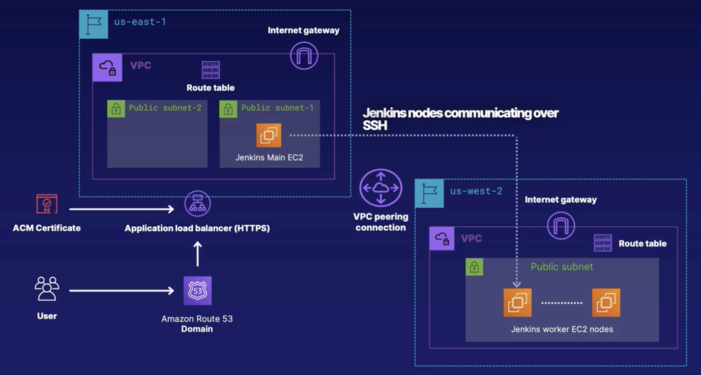

# ansible_terraform_aws

Create a distributed, multi-region, Jenkins CI/CD Deployment using Ansible, Terraform, and AWS

---

## Services

- [Terraform](https://www.terraform.io/): Cloud Agonistic Infrastructure as Code (IaC) service
- [Ansible](https://www.ansible.com/): IaC application-deployment tool for provisioning and configuration management
- Amazon Web Services (AWS): Cloud Infrastructure Provider on Amazon Platform

---

### Prerequisites

- Download & Install Terraform
- Download & Install Ansible
- AWS user and the appropriate user permissions to create the appropriate resources (look at infrastructure section for resources)
- Download & Configure AWS CLI

---

### Infrastructure

- Regions:
    - us-east-1:
        - VPC:
            - Two public subnets:
                - One EC2 instance with Jenkins
            - Internet Gateway
    - us-west-2:
        - VPC:
            - One public subnet:
                - One EC2 instance with Jenkins
            - Internet Gateway
- VPC Peering between two VPCs in two different regions
    - Two jenkins nodes communicating over ssh
- Load Balancer with Jenkins main node behind it
    - Certificate
    - AWS Route53 Domain

---

### Project Infrastructure

The infrastructure for the project is as defined below.

├── README.md <-------------- This guide to the project.

├── terraform<------------ Contains terraform code for creating AWS Infrastructure

└──imgs <------------------ images for README.md

### Running the Project

- Change directory into a folder with terraform code
- Change the main.tf file to your unique configurations (comments are in the file for guidance)
- Run the following commands:

`terraform init` initalizes your working directory

`terraform plan` shows the execution plan for your infrastructure. Lets you see which resources are being created

Optional: `terraform validate` checks the syntax of the terraform code 

`terraform apply` apply changes to the infrastructure through changes made in the main.tf file
